# Online-Chat-App 
This is an Online Chat Application developed by Lingwei Luo

It is an Online Chat Platform which is similar to WeChat  

Overview
---------

* Frontend
  * Language: JavaScript + HTML + CSS
  * Framework: mui + H5plus

* Backend
  * Language: Java
  * Framework: Spring Boot + netty
  * Tools: maven

* Database
  * mysql + mybatis
  

Supported modules
---------
* User related
    * Regist, Login, Logout  
    * Change face image
    * Set my nickname
    * Show my QRcode
    * Search to add user
    * Scan QRcode to add user
    * Show contacts
    * Search user in contacts
    
* Chat related
    * Send messages to users
    * Receive messages from users
    * Receive messages offline
    * Show chat snapshots
    * Save chat history lcoally
    * Save chat snapshots lcoally
    * Disconnect automatically when offline

Program presentation
---------

    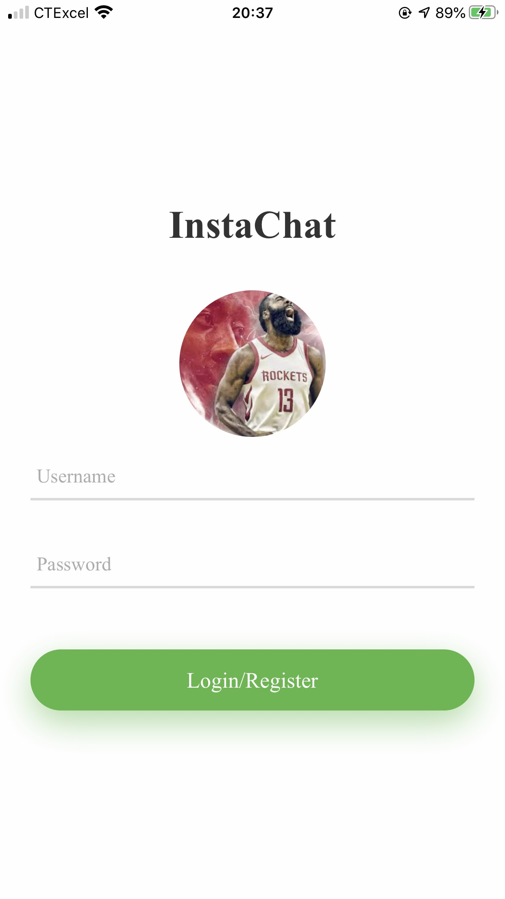
    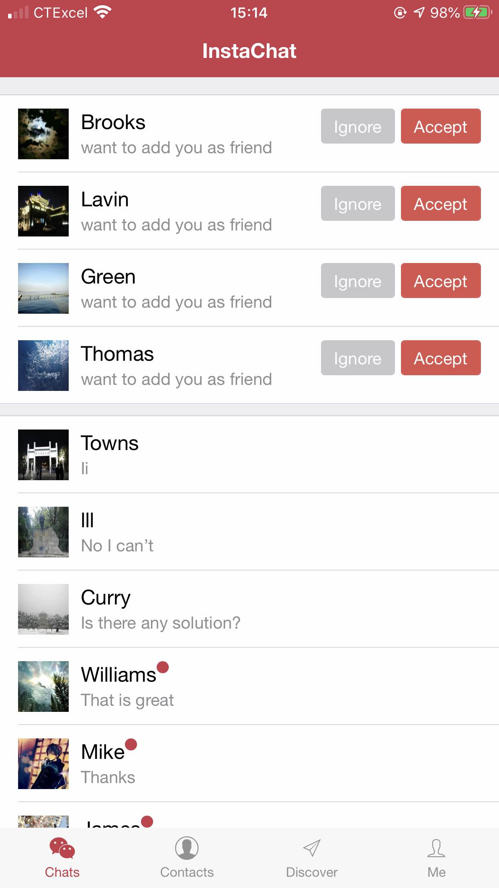

    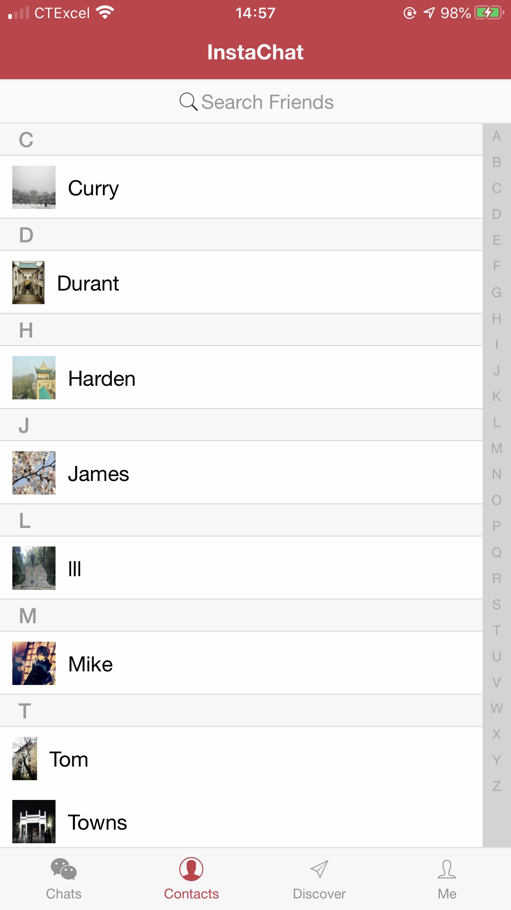
    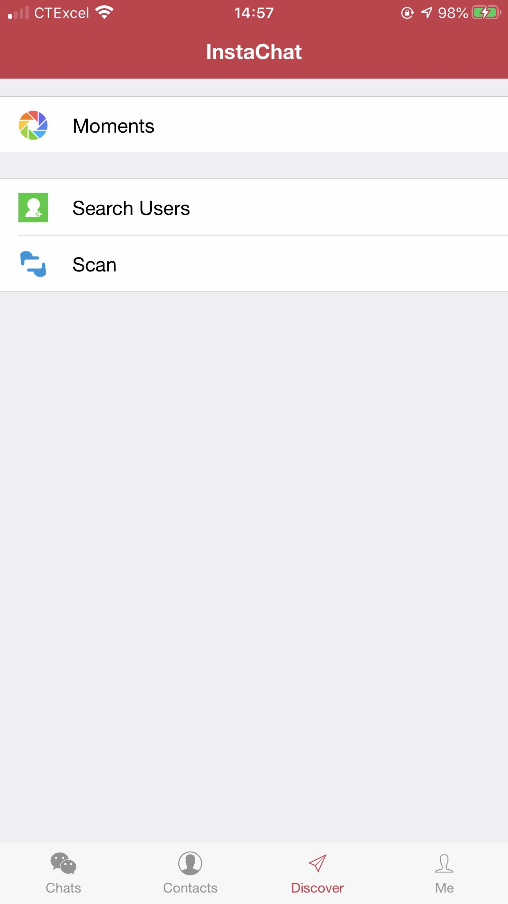

    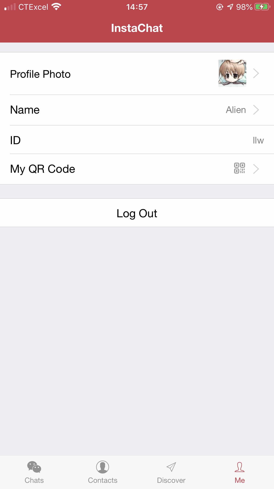
    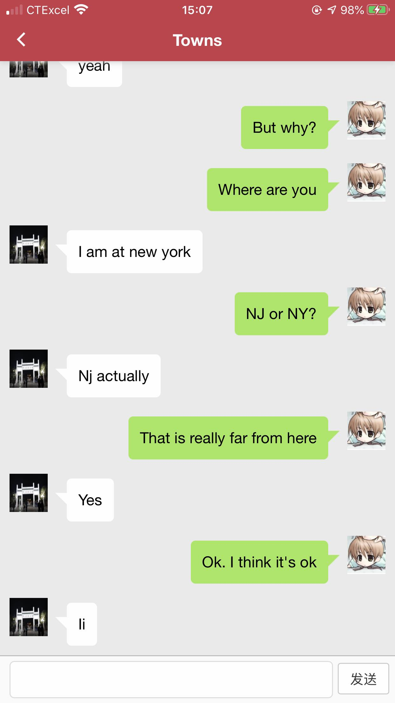

    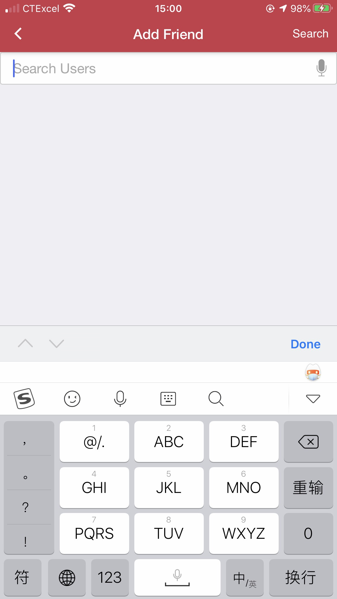
    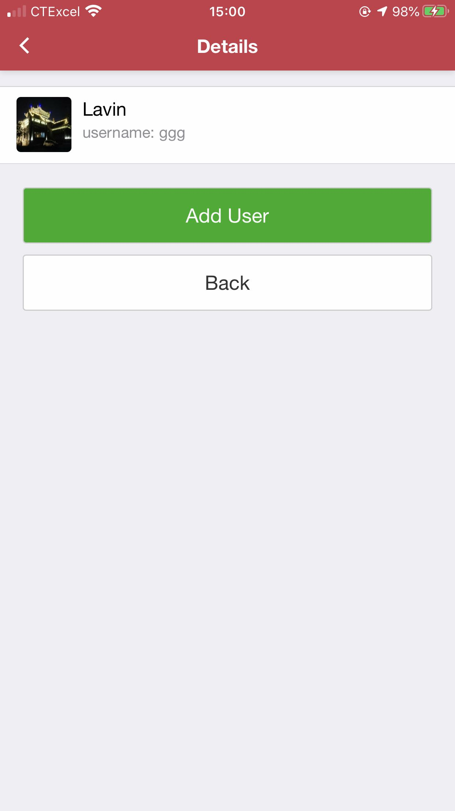

    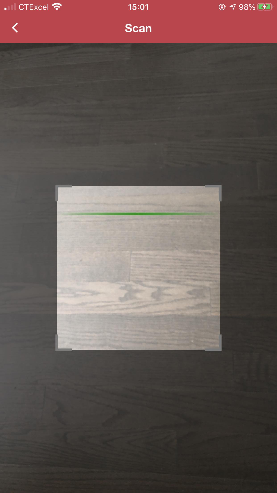
    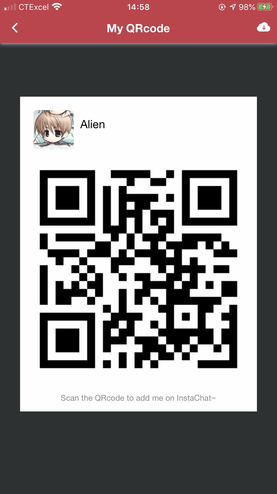

    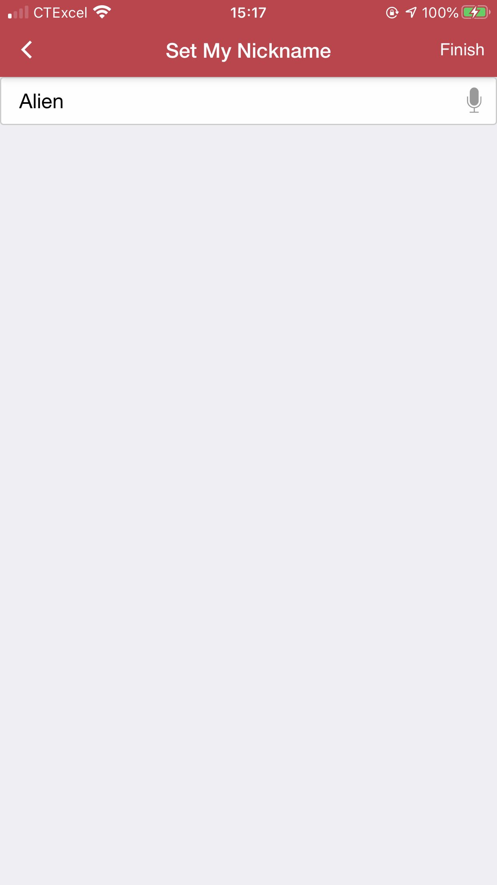
    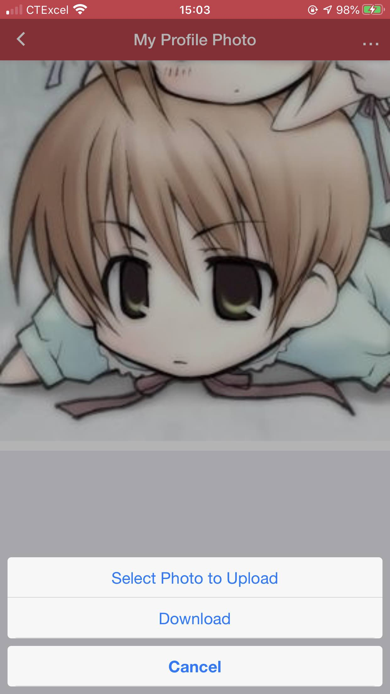

